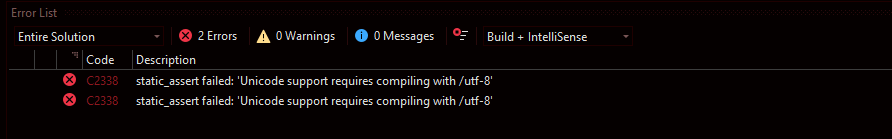
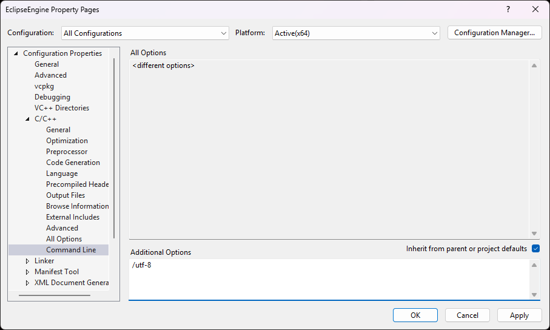

# Build Guide for Eclipse Engine

## Issues while compiling

### Unicode support required

- Error

    

- Fix

    

    Right click on project name > C/C++ > Command Line and add `/utf-8` to additional options.

[Back to README](README.md)